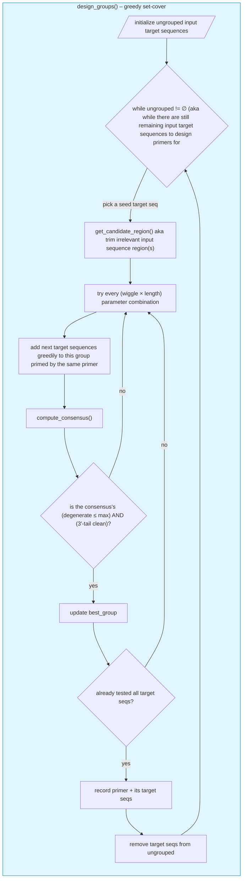

# Overview
These scripts aid in the generation of BCRseq "OE-RT-PCR" and "Nested" primers for any organism (any organism for which the user possesses heavy and light chain V and C gene sequences; see "Helpful Resources" below). In this repository, ferret sequences are used as example to demonstrate necessary inputs and expected outputs. 

### Notes & caveats:
- The most useful script here is `generate_primers.py`. It helps create the highly multiplexed forward (V gene) primers, which is arguably the most tedious component of designing OE-RT-PCR primers.
- These scripts cannot be used alone for perfect primer generation. Primers must be tested to the user's satisfaction *in vitro* to ensure e.g. expected amplicon length and/or breadth of gene capture.
- Currently, the "overlap" and "common" subsequences of primers required for overlap-extension-RT-PCR must be added manually.

## Background

"BCRseq" or B cell receptor sequencing traditionally involves the isolation of bulk mRNA from peripheral blood mononuclear cells (which are ~10% B cells in humans) followed by the reverse transcription & ultimate high-throughput sequencing of only BCR mRNA. Authors of the two publications linked below pioneered a method to not only acquire heavy chain or light chain BCR transcript sequences, but capture the natively paired transcripts of both chains in one sequence. 
- [McDaniel JR, DeKosky BJ, Tanno H, Ellington AD, Georgiou G. Ultra-high-throughput sequencing of the immune receptor repertoire from millions of lymphocytes. Nat Protoc. 2016 Mar;11(3):429-42. doi: 10.1038/nprot.2016.024. Epub 2016 Feb 4. PMID: 26844430.](https://pubmed.ncbi.nlm.nih.gov/26844430/)
- [Tanno H, McDaniel JR, Stevens CA, Voss WN, Li J, Durrett R, Lee J, Gollihar J, Tanno Y, Delidakis G, Pothukuchy A, Ellefson JW, Goronzy JJ, Maynard JA, Ellington AD, Ippolito GC, Georgiou G. A facile technology for the high-throughput sequencing of the paired VH:VL and TCRβ:TCRα repertoires. Sci Adv. 2020 Apr 22;6(17):eaay9093. doi: 10.1126/sciadv.aay9093. PMID: 32426460; PMCID: PMC7176429.](https://pmc.ncbi.nlm.nih.gov/articles/PMC7176429/)

The above papers focused on human BCR genes and already provides emperically validated overlap-extension reverse-transcription PCR (OE-RT-PCR) primers for humans. However, a number of potential use cases of BCRseq could benefit from redesigning these primers, such as e.g. BCRseq in a non-human model organism or human population-specific BCRseq with a specific subset of Ig gene alleles in mind. This repository's scripts aid in the initial design of (esp. OE-RT-PCR forward) primers for those applications and more.


## Contents
- `generate_primers.py`: This script takes a FASTA file of some target V gene sequences (e.g. heavy chain V gene framework 1 sequences) and a handful of user provided parameters such as range of allowable primer length, number of allowable degenerate nucleotide positions, etc. It outputs suggested primers and their corresponding target sequences.

- `IG*V` directories: include both the necessary input files for designing ferret bcrseq V gene primers (e.g. "ighv_fam1.fasta") as well as the output from "generate_primers.py"

- `bad_c_areas.py`: This script takes a FASTA file of all target C gene sequences and searches for areas to avoid priming due to perfect shared homology between two or more C genes.

- `revcomp.py`: Small script that simply takes an input FASTA and creates a new FASTA with reverse compliment versions of the input's sequences. Can be helpful when manually designing C gene primers.

- `all_Cs`: Includes the relevant input ferret C gene sequences tested for undesirable priming areas using "bad_c_areas.py" as well as the output and resulting manually-chosen C gene primer sequence choices.

- `primer_issues.py`: This script takes a FASTA file of all candidate primers in a given reaction mix. It evaluates them for potential issues involving GC clamps, melting temperatures, hidden complementarity, and repeat runs.

- `environment.yml`: Conda environment i.e. dependencies file for ease of setup

# Helpful resources

- **Getting target gene sequences for your species of interest**: Assuming your organism's immunoglobulin genes have been sufficiently annotated. [IMGT's gene lookup tool](https://www.imgt.org/genedb/) is highly useful for acquiring the necessary V and C gene sequences/regions used as input for this repository's script(s). 

- **Double checking primer targets**: The [Clustal Omega multiple sequence alignment tool](https://www.ebi.ac.uk/jdispatcher/msa/clustalo) is useful for a quick double-check that the primers suggested by `generate_primers.py` do target the user's desired location, and can provide information that informed any degenerate primer positions. Alternatively, to manually compare generated primers to your target sequences, it can be convenient to first make a sequence logo from said targets. The [WebLogo in-browser tool](https://weblogo.berkeley.edu/logo.cgi) makes this easy.

- **Phylogenetic Trees**: Sometimes it is useful to first sub-divide target sequences by hand-picked phylogenetic clades before applying `generate_primers.py`. If the first application of `generate_primers.py` results in more primers than the user wants, I suggest trying this. The [Clustal Omega multiple sequence alignment tool](https://www.ebi.ac.uk/jdispatcher/msa/clustalo) is also useful for this.

# Understanding how `generate_primers.py` works
Below is a diagram showing the control structure in the heart of `generate_primers.py`


# Toy example for `generate_primers.py`:

## **User's Parameters**

* `--prime_side start` (*start from the 5' end of the target sequences. Choosing "end" would target the 3' end.*)
* `--prime_offset 0` (*this is a vestige of an earlier script design; it combines with --prime_side to determine where on the 5' or 3' end the primable window should start. Here, an offset of 0 means the very first 5' position is where the script will start testing.*)
* `--prime_wiggle 1` (*allows the desired primable window to be shifted by 1 position at most, in the attempt to generate fewer primers i.e. more target coverage per primer*)
* `--primer_length_range 7-7` (*A range of allowed primer lengths. Here the only allowed length is 7. In the real world, this range will likely start around 20*)
* `--max_degenerate 2` (*The number of degenerate nucleotide positions allowed in any given primer. Here, two IUPAC degenerate positions are allowed.*)
* `--nondegenerate_tail 2` (*The 3' tail of a primer is important for GC clamps. Allowing degeneracy in the tail can be detrimental to primer clamping, so this is the number of 3' positions in which degeneracy is never allowed in the generated primer set.*)
* `--orientation fwd` (*Relative to the input target sequences, what direction should the generated primers be oriented? fwd = same orientation as the inputs*)

Note: the user decided roughly where GC clamps should be.

## **User's (toy) input sequences**
Each input sequence must be the same length (in this instance, 12 nt)
```
T1 : ATGCC AAGGC AA
T2 : ATGCT AAGGC AA   (note pos5 C->T)
T3 : ATGCC AAGGC AA
T4 : ATGCC GAGGC AA   (note pos6 A->G)
T5 : ATGCC AAGGC AA
T6 : GAATC CTGGC AA   (note only last 3 positions conserved with T1-T5)
T7 : CAATC CTGGC AA   (note only last 3 positions conserved with T1-T5)
```

## **Algorithm, step-by-step**

### Initialization

* Ungrouped = {T1...T7}
* Groups = \[]


### Pass 1 (Ungrouped has all 7 sequences)

1. Script tries offset=0, len=7 (bases 1..7).

   * For a seed like T1 >> window = `ATGCCAA`.
   * Adding T2, T3, T4, T5 >> consensus = `ATGCYRA` (Y=C/T, R=A/G). Degeneracy = 2.
   * Last 2 bases = `RA` >> the `R` is degenerate >> FAILS tail check.
   * So offset=0 is not usable here.

2. Script tries offset=1, len=7 (bases 2..8).

   * For T1 >> window = `TGCCAAG`.
   * Adding T2, T3, T4, T5 >> consensus = `TGCYRAG`. Degeneracy = 2.
   * Last 2 bases = `AG`. Both non-degenerate >> PASSES tail check.
   * Attempting to add T6 or T7 here blows degeneracy way past 2 (several columns differ) >> rejected.
   * Best group for this pass = `{T1,T2,T3,T4,T5}`, primer `TGCYRAG`.

3. Record this group, remove its members.

   * Groups = \[primer1 = `TGCYRAG`, members T1-T5]
   * Ungrouped = {T6,T7}


### Pass 2 (Ungrouped = {T6,T7})

1. Script again checks offset=0, len=7.

   * T6 window = `GAATCCT`
   * T7 window = `CAATCCT`
   * Consensus = `RAATCCT` (R=G/C), degeneracy = 1.
   * Last 2 bases = `CT` >> non-degenerate >> PASSES tail check.

2. Best group for this pass = `{T6,T7}`, primer `RAATCCT`.

3. Record group, remove members.

   * Groups = \[primer1, primer2]
   * Ungrouped = ∅ >> stop.


## **Final Output**

### Primer FASTA

(Includes primer metadata in the record descriptions)
```
>primer1 len:7 degenerate:2 targets:5 covers:T1,T2,T3,T4,T5
TGCYRAG
>primer2 len:7 degenerate:1 targets:2 covers:T6,T7
RAATCCT
```

### Group FASTAs

* `primer1.fasta` contains sequences of T1-T5
* `primer2.fasta` contains sequences of T6-T7

### TSV primer-target mappings

```
Target  Group    Primer
T1      primer1  TGCYRAG
T2      primer1  TGCYRAG
T3      primer1  TGCYRAG
T4      primer1  TGCYRAG
T5      primer1  TGCYRAG
T6      primer2  RAATCCT
T7      primer2  RAATCCT
```