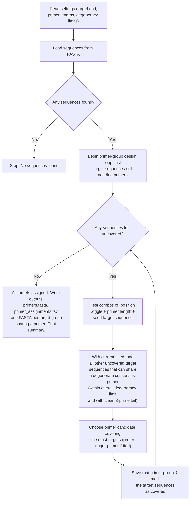

# Overview
These scripts aid in the generation of BCRseq "OE-RT-PCR" and "Nested" primers for any organism (any organism for which the user possesses heavy and light chain V and C gene sequences; see "Helpful Resources" below). In this repository, ferret sequences are used as example to demonstrate necessary inputs and expected outputs. 

### Notes & caveats:
- The most useful script here is `generate_primers.py`. It helps create the highly multiplexed forward (V gene) primers, which is arguably the most tedious component of designing OE-RT-PCR primers.
- These scripts cannot be used alone for perfect primer generation. Primers must be tested to the user's satisfaction *in vitro* to ensure e.g. expected amplicon length and/or breadth of gene capture.
- Currently, the "overlap" and "common" subsequences of primers required for overlap-extension-RT-PCR must be added manually.

## Background

"BCRseq" or B cell receptor sequencing traditionally involves the isolation of bulk mRNA from peripheral blood mononuclear cells (which are ~10% B cells in humans) followed by the reverse transcription & ultimate high-throughput sequencing of only BCR mRNA. Authors of the two publications linked below pioneered a method to not only acquire heavy chain or light chain BCR transcript sequences, but capture the natively paired transcripts of both chains in one sequence. 
- [McDaniel JR, DeKosky BJ, Tanno H, Ellington AD, Georgiou G. Ultra-high-throughput sequencing of the immune receptor repertoire from millions of lymphocytes. Nat Protoc. 2016 Mar;11(3):429-42. doi: 10.1038/nprot.2016.024. Epub 2016 Feb 4. PMID: 26844430.](https://pubmed.ncbi.nlm.nih.gov/26844430/)
- [Tanno H, McDaniel JR, Stevens CA, Voss WN, Li J, Durrett R, Lee J, Gollihar J, Tanno Y, Delidakis G, Pothukuchy A, Ellefson JW, Goronzy JJ, Maynard JA, Ellington AD, Ippolito GC, Georgiou G. A facile technology for the high-throughput sequencing of the paired VH:VL and TCRβ:TCRα repertoires. Sci Adv. 2020 Apr 22;6(17):eaay9093. doi: 10.1126/sciadv.aay9093. PMID: 32426460; PMCID: PMC7176429.](https://pmc.ncbi.nlm.nih.gov/articles/PMC7176429/)

The above papers focused on human BCR genes and already provides emperically validated overlap-extension reverse-transcription PCR (OE-RT-PCR) primers for humans. However, a number of potential use cases of BCRseq could benefit from redesigning these primers, such as e.g. BCRseq in a non-human model organism or human population-specific BCRseq with a specific subset of Ig gene alleles in mind. This repository's scripts aid in the initial design of (esp. OE-RT-PCR forward) primers for those applications and more.

## Contents
- `generate_primers.py`: This script takes a FASTA file of some target V gene sequences (e.g. heavy chain V gene framework 1 sequences) and a handful of user provided parameters such as range of allowable primer length, number of allowable degenerate nucleotide positions, etc. It outputs suggested primers and their corresponding target sequences.

- `IG*V` directories: include both the necessary input files for designing ferret bcrseq V gene primers (e.g. "ighv_fam1.fasta") as well as the output from "generate_primers.py"

- `bad_c_areas.py`: This script takes a FASTA file of all target C gene sequences and searches for areas to avoid priming due to perfect shared homology between two or more C genes.

- `revcomp.py`: Small script that simply takes an input FASTA and creates a new FASTA with reverse compliment versions of the input's sequences. Can be helpful when manually designing C gene primers.

- `all_Cs`: Includes the relevant input ferret C gene sequences tested for undesirable priming areas using "bad_c_areas.py" as well as the output and resulting manually-chosen C gene primer sequence choices.

- `primer_issues.py`: This script takes a FASTA file of all candidate primers in a given reaction mix. It evaluates them for potential issues involving GC clamps, melting temperatures, hidden complementarity, and repeat runs.

- `environment.yml`: Conda environment i.e. dependencies file for ease of setup

## Helpful resources

- **Getting target gene sequences for your species of interest**: Assuming your organism's immunoglobulin genes have been sufficiently annotated. [IMGT's gene lookup tool](https://www.imgt.org/genedb/) is highly useful for acquiring the necessary V and C gene sequences/regions used as input for this repository's script(s). 

- **Double checking primer targets**: The [Clustal Omega multiple sequence alignment tool](https://www.ebi.ac.uk/jdispatcher/msa/clustalo) is useful for a quick double-check that the primers suggested by `generate_primers.py` do target the user's desired location, and can provide information that informed any degenerate primer positions. Alternatively, to manually compare generated primers to your target sequences, it can be convenient to first make a sequence logo from said targets. The [WebLogo in-browser tool](https://weblogo.berkeley.edu/logo.cgi) makes this easy.

- **Phylogenetic Trees**: Sometimes it is useful to first sub-divide target sequences by hand-picked phylogenetic clades before applying `generate_primers.py`. If the first application of `generate_primers.py` results in more primers than the user wants, I suggest trying this. The [Clustal Omega multiple sequence alignment tool](https://www.ebi.ac.uk/jdispatcher/msa/clustalo) is also useful for this.

## Diagram of `generate_primers.py` logic:

